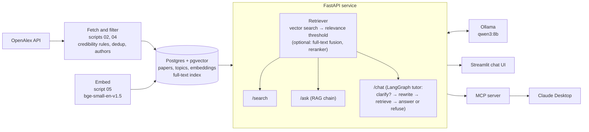

# paper-tutor


paper-tutor is a study assistant that answers questions from a curated database of
research papers instead of from the open web. It downloads papers from
[OpenAlex](https://openalex.org), keeps only those that pass a set of credibility rules
(peer-reviewed venue list, a real abstract, not retracted, English), removes duplicates,
stores them in Postgres with vector embeddings, and answers questions with a local LLM
that must cite the papers it used, or say that the database has nothing relevant. It is built the way a company would build an internal
AI system over its own documents: a data pipeline, a database, an HTTP API, a chat UI,
a tool for an AI assistant, and an evaluation of retrieval quality. The current corpus
has 6,933 papers in statistics, econometrics, machine learning, deep learning,
economics, finance and cloud infrastructure.

**Stack:** Python · PostgreSQL + pgvector · FastAPI · LangChain · LangGraph · MCP · Ollama · Streamlit · Docker · GitHub Actions

## Architecture



- **Pipeline** (`scripts/`): numbered scripts that fetch, explore, load, embed, search,
  evaluate and ask. Shared logic lives in `src/paper_tutor/`.
- **Database** (`sql/schema.sql`): three tables, `topics`, `papers` and `embeddings`
  (one row per paper and embedding model, so models can be compared side by side).
- **API** (`src/paper_tutor/api.py`): loads the retriever (embedding model, and the
  reranker if it is switched on), the LLM chain and the tutor once at startup.
- **Clients**: the Streamlit app and the MCP server both talk to the API over HTTP.

## Features

Every behaviour below can be switched in `config/syllabus.yaml`, so old and new settings
can be compared. The defaults are the best settings measured (see Evaluation).

- **Credibility rules** (`settings` in the config, `corpus.py`): keep only articles,
  reviews, preprints and conference papers; English only; drop retracted papers; journal
  articles must come from a venue on the CWTS core list (preprints and conference papers
  are exempt); the abstract must have at least 30 words. Below 30 words the "abstracts"
  in OpenAlex are mostly citation strings ("Technometrics, Vol. 31, No. 2, pp. 270-271"),
  publisher boilerplate or a single word; this rule removed about 200 papers.
- **Deduplication**: papers with the same normalised title published within 3 years of
  each other are one paper, e.g. an arXiv preprint and its conference version, or a
  conference paper and its later journal version. The published version is kept, then
  the one with a DOI, a venue and the longer abstract. 75 duplicates are merged, 31 of
  them across years.
- **Authors**: the first five author names per paper, shown in the sources and given to
  the LLM, which may name authors only when they appear in the sources.
- **Embeddings**: title and abstract embedded with `BAAI/bge-small-en-v1.5`, searched
  by cosine distance in pgvector. `Qwen/Qwen3-Embedding-0.6B` is also stored for
  comparison; the active model is set in the config.
- **Retrieval** (`rag.py`, `retrieval` in the config):
  - vector search (default),
  - optional hybrid search: Postgres full-text search on title and abstract (GIN index),
    fused with the vector ranking by Reciprocal Rank Fusion,
  - optional reranking of 30 candidates with the cross-encoder `BAAI/bge-reranker-base`,
  - a relevance threshold (default: cosine similarity 0.62). If no paper passes, nothing
    is returned and the tutor says the database has no relevant papers instead of
    answering from irrelevant ones.
- **API endpoints**:
  - `GET /health`: status, active embedding model and retrieval settings.
  - `POST /search`: up to k relevant papers with authors, no LLM.
  - `POST /ask`: a single cited answer from the top papers (no memory).
  - `POST /chat`: the tutor with memory per `thread_id`.
- **LangGraph tutor** (`tutor.py`):
  - A first question that points at something it doesn't name ("When does it fail?") is
    answered with a clarifying question instead of a search (conditional edge, rule-based
    check in `is_vague`).
  - Follow-up questions such as "how does it compare to ridge?" are rewritten into a
    standalone search query using the conversation.
  - If retrieval returns no papers, the tutor refuses instead of answering (second
    conditional edge); otherwise it answers with the conversation in context.
  - Two answer prompts: `basic`, and `strict` (every sentence must be backed by a cited
    source, no outside knowledge). Memory is kept in process (`InMemorySaver`).
- **MCP tool** (`mcp_server.py`): exposes `search_papers` so Claude Desktop can search
  the database and cite real papers, with authors.
- **Evaluation** (`scripts/07`, `08`, `11`, `12`): retrieval metrics with confidence
  intervals, out-of-scope questions, threshold calibration and a citation faithfulness
  check.

## Evaluation

### Retrieval

30 test questions (`eval/questions.yaml`): 28 written for one specific paper each (4 per
area), plus 2 real-use failure cases about choosing priors. For each question the top 10
papers are retrieved and the rank of the relevant paper is recorded. 10 out-of-scope
questions (`eval/out_of_scope.yaml`: sourdough bread, football transfers, the UI text
"Searched for", ...) check whether the system refuses. Results are in `eval/results/`
(`uv run python scripts/07_evaluate.py`, add e.g. `rerank=true` to try a variant).

| Variant (bge-small, n = 30) | hit@1 | hit@5 | hit@10 | MRR | hit@5 95% Wilson CI | out-of-scope refused |
|---|---|---|---|---|---|---|
| Baseline: vector search, before data cleanup | 0.37 | 0.50 | 0.67 | 0.44 | [0.33, 0.67] | 0/10 |
| Vector search, after data cleanup | 0.37 | 0.50 | 0.67 | 0.44 | [0.33, 0.67] | 0/10 |
| + hybrid (full-text + RRF) | 0.20 | 0.40 | 0.50 | 0.28 | [0.25, 0.58] | 0/10 |
| + reranker | 0.30 | 0.50 | 0.67 | 0.40 | [0.33, 0.67] | 0/10 |
| + hybrid + reranker | 0.23 | 0.47 | 0.60 | 0.36 | [0.30, 0.64] | 0/10 |
| + reranker + threshold 0.0005 | 0.30 | 0.47 | 0.60 | 0.39 | [0.30, 0.64] | 6/10 |
| **+ similarity threshold 0.62 (default)** | **0.37** | **0.50** | **0.67** | **0.44** | **[0.33, 0.67]** | **9/10** |

What this shows:

- **Data cleanup** (minimum abstract length, cross-year dedup) did not change retrieval
  on these questions; it removes junk records and duplicate sources.
- **Hybrid search made retrieval worse.** On these questions full-text search adds no
  new relevant papers: a relevant paper is among the 30 vector candidates for 24 of 30
  questions, and among the vector and full-text candidates together also for 24. The
  test questions were written on purpose without distinctive words from the paper's
  title, which is hard for keyword search, so hybrid search may still help keyword-style
  queries. It is implemented but off.
- **The reranker did not measurably help.** It changes the top 5 a lot, and many of its
  new papers look relevant on inspection (for "weakly informative priors" its first hit
  is Gelman's 2006 paper on priors for variance parameters, not the 2008 paper the
  question was written for). But these papers were never judged, so they count as
  misses. It is implemented but off until new judgments exist.
- **The threshold** refuses 9 of 10 out-of-scope questions without losing any in-scope
  question or hit. It was chosen with `scripts/12_threshold.py`: every in-scope question
  has a best similarity of at least 0.653, every out-of-scope question except "Searched
  for" (0.660) at most 0.577; 0.62 is in the middle of that gap. The reranker's scores
  separate worse on these long questions: no reranker threshold refuses more than 5 of 10
  out-of-scope questions without losing a hit.
- n = 30, so differences of one or two questions are within noise (the intervals overlap).

**Pooled judgments.** Counting only one paper as relevant is strict, because other papers
can answer the same question. So the top 5 of bge-small and Qwen3 (plus the original
paper) were pooled and judged for relevance (`eval/judgments.yaml`, 239 judgments, 28
questions; `uv run python scripts/08_pooled_evaluate.py`). Unjudged papers count as not
relevant, so these are lower bounds:

| Variant | hit@5 (pooled) | 95% Wilson CI | MRR (lower bound) | unjudged papers in top 5 |
|---|---|---|---|---|
| Vector search (baseline and default) | 24/30 | [0.63, 0.90] | 0.70 | 0–2 |
| + hybrid | 22/30 | [0.56, 0.86] | 0.49 | 74 |
| + reranker | 24/30 | [0.63, 0.90] | 0.62 | 69 |
| + hybrid + reranker | 23/30 | [0.59, 0.88] | 0.57 | 76 |

With about 70 of 150 top-5 papers unjudged, the hybrid and reranker rows are not a fair
comparison; new judgments for those papers are needed before deciding about them.

How to read all these numbers:

- The test questions and the relevance judgments were written by an LLM, not by people.
  The judge saw titles and abstracts in shuffled order without model or rank labels, but
  had already seen the models' results earlier, so the judging was **not fully blind**.
  A human review of a sample is still open
  ([#5](https://github.com/AymenFeki/paper-tutor/issues/5)).
- Questions were written while reading each abstract, so they may be easier than real
  student questions.
- The Qwen3-Embedding-0.6B result (`eval/results/qwen3-0.6b.json`) is from the earlier
  28-question run on the corpus before cleanup.

### Citation faithfulness

`scripts/11_faithfulness.py` asks the tutor 10 eval questions (every third one), splits
each answer into sentences, and for every citation asks the LLM whether the cited
paper's title and abstract support the sentence. Results are in `eval/faithfulness/`.

| Answer prompt | supported citations | 95% Wilson CI | sentences with a citation |
|---|---|---|---|
| basic (before) | 23/29 (0.79) | [0.62, 0.90] | 28/55 (0.51) |
| **strict (default)** | **24/30 (0.80)** | **[0.63, 0.90]** | **30/53 (0.57)** |

The strict prompt ("every sentence must be supported by a cited source, no outside
knowledge") made almost no difference: qwen3:8b still writes uncited sentences, some with
outside knowledge (e.g. listing image augmentations that are not in the abstract), and
still cites a source for general textbook statements. **The judge is the same 8B model
and is itself unreliable**, so these numbers are a rough signal; a sample should be
checked by hand.

## Screenshots

Coming soon.

## Quickstart

### Prerequisites

- [uv](https://docs.astral.sh/uv/) (Python 3.12 is installed by uv if needed)
- [Docker](https://www.docker.com/) with Docker Compose
- [Ollama](https://ollama.com) with the model pulled: `ollama pull qwen3:8b`
- An [OpenAlex API key](https://openalex.org)
- A `.env` file in the project root with two variables:
  - `OPENALEX_API_KEY`: your OpenAlex key
  - `POSTGRES_PASSWORD`: any password; Docker Compose uses it to create the database

### Build the database and start the app

```bash
uv sync               # install dependencies
make rebuild          # start Postgres, create tables, fetch, load and embed papers
make api              # start the API on http://127.0.0.1:8000 (keep it running)
make ui               # in a second terminal: start the chat UI
```

Other targets: `make test` (unit tests), `make lint` (ruff), the single steps
`make db-up`, `make schema`, `make fetch`, `make load`, `make embed`, and the evaluations
`make evaluate`, `make threshold` and `make faithfulness`. Fetching skips topics and
authors that are already downloaded to `data/raw/`. Loading removes papers from the
database that no longer pass the rules, together with their embeddings.

Try the API directly:

```bash
curl -X POST http://127.0.0.1:8000/search \
  -H "Content-Type: application/json" \
  -d '{"question": "What is the lasso?", "k": 3}'
```

### Use it from Claude Desktop (MCP)

With the API running, add this to Claude Desktop's `claude_desktop_config.json` and
restart Claude Desktop. Replace the paths with your own (`which uv` shows the path to uv).

```json
{
  "mcpServers": {
    "paper-tutor": {
      "command": "/absolute/path/to/uv",
      "args": [
        "--directory", "/absolute/path/to/paper-tutor",
        "run", "python", "-m", "paper_tutor.mcp_server"
      ]
    }
  }
}
```

The MCP server calls the API at `http://127.0.0.1:8000`; set `PAPER_TUTOR_API` in an
`"env"` block to change it.

## Known limitations

- **Retrieval ranking is unstable across query wordings.** For eight wordings of "how
  should I choose a prior?", Gelman et al. (2008) is in the top 3 for only 3 of them.
  Neither the reranker ([#1](https://github.com/AymenFeki/paper-tutor/issues/1)) nor
  hybrid search ([#2](https://github.com/AymenFeki/paper-tutor/issues/2)) improved the
  evaluation; deciding properly needs new relevance judgments.
- **The threshold is calibrated on full questions, not keywords.** Short keyword queries,
  as Claude Desktop sends them through MCP, have different similarities: "football
  transfers" (0.624) and "pasta recipe" (0.626) pass the 0.62 threshold, while the
  in-scope "Jeffreys prior" scores only 0.628. The reranker separates short queries well
  (all off-topic ones below 0.1, all on-topic ones above 0.98), but not long questions.
  A test set with keyword queries is needed
  ([#22](https://github.com/AymenFeki/paper-tutor/issues/22)).
- **Citations from the 8B model are not always faithful**, even with the strict prompt,
  and the faithfulness check uses the same 8B model as judge
  ([#7](https://github.com/AymenFeki/paper-tutor/issues/7)).
- **Short-abstract junk above 30 words remains**, e.g. reference strings like "Claes
  Fornell, David F. Larcker, Structural Equation Models with ..., Journal of ...".
- **Only the first five authors are stored**, so the sources cannot say whether a paper
  has more authors.
- **The clarification check is a simple word rule.** It catches "When does it fail?" but
  not every vague question, and "Searched for" is still searched.

## Roadmap

- n8n workflows: a daily quiz via Telegram and a weekly fetch of new papers
  ([#14](https://github.com/AymenFeki/paper-tutor/issues/14)).
- Optional cloud deployment
  ([#18](https://github.com/AymenFeki/paper-tutor/issues/18)).