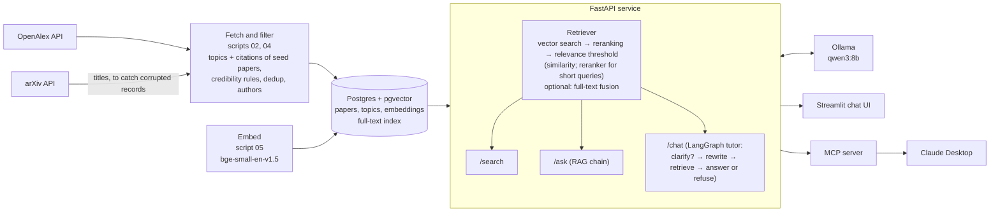

# paper-tutor


paper-tutor is a study assistant that answers questions from a curated database of
research papers instead of from the open web. It downloads papers from
[OpenAlex](https://openalex.org), keeps only those that pass a set of credibility rules
(peer-reviewed venue list, a real abstract, not retracted, English), removes duplicates,
stores them in Postgres with vector embeddings, and answers questions with a local LLM
that must cite the papers it used, or say that the database has nothing relevant. It is built the way a company would build an internal
AI system over its own documents: a data pipeline, a database, an HTTP API, a chat UI,
a tool for an AI assistant, and an evaluation of retrieval quality. The current corpus
has 7,226 papers in statistics, econometrics, machine learning, deep learning, LLMs and
agents, economics, finance and cloud infrastructure.

**Stack:** Python · PostgreSQL + pgvector · FastAPI · LangChain · LangGraph · MCP · Ollama · Streamlit · Docker · GitHub Actions

## Architecture



- **Pipeline** (`scripts/`): numbered scripts that fetch, explore, load, embed, search,
  evaluate and ask. Shared logic lives in `src/paper_tutor/`.
- **Database** (`sql/schema.sql`): three tables, `topics`, `papers` and `embeddings`
  (one row per paper and embedding model, so models can be compared side by side).
- **API** (`src/paper_tutor/api.py`): loads the retriever (embedding model and reranker),
  the LLM chain and the tutor once at startup.
- **Clients**: the Streamlit app and the MCP server both talk to the API over HTTP.

## Features

Every behaviour below can be switched in `config/syllabus.yaml`, so old and new settings
can be compared. The defaults are the best settings measured (see Evaluation).

- **Credibility rules** (`settings` in the config, `corpus.py`): keep only articles,
  reviews, preprints and conference papers; English only; drop retracted papers; journal
  articles must come from a venue on the CWTS core list (preprints and conference papers
  are exempt); the abstract must have at least 30 words. Below 30 words the "abstracts"
  in OpenAlex are mostly citation strings ("Technometrics, Vol. 31, No. 2, pp. 270-271"),
  publisher boilerplate or a single word; this rule removed about 200 papers.
- **Deduplication**: papers with the same normalised title published within 3 years of
  each other are one paper, e.g. an arXiv preprint and its conference version, or a
  conference paper and its later journal version. The published version is kept, then
  the one with a DOI, a venue and the longer abstract. 78 duplicates are merged, 34 of
  them across years.
- **LLMs and agents area** ([#9](https://github.com/AymenFeki/paper-tutor/issues/9)): built around five seed papers (RAG, ReAct, Toolformer,
  Chain-of-Thought, GPT-3) instead of OpenAlex topics. Candidates are the 200 most-cited
  papers citing each seed plus the papers the seeds cite (999 papers). They go through the
  same credibility rules (833 pass; conference papers and preprints are exempt from the
  venue list, which matters because ML is published on arXiv and at conferences), must
  mention an LLM keyword in title or abstract (597; without this filter the most-cited
  candidates were LSTM, GloVe, word2vec and Vision Transformers, which cite or are cited by
  GPT-3), and must not have a corrupted arXiv record (see below). The 300 most-cited are
  kept; 293 are new to the corpus, the others were already in another area.
- **Corrupted OpenAlex records**: some records keep the DOI and citation count of a famous
  arXiv paper but show an unrelated title, abstract and references. The arXiv DOIs of RAG,
  ReAct and Chain-of-Thought point to records titled "Affordance-Compiled Intelligence",
  "Distributing Accountability, Not Capability" and "BNAI, NO-TOKEN, and MIND-UNITY".
  `02_fetch.py` downloads arXiv's own titles, and records whose title differs are dropped
  (`check_arxiv_titles`); references are only taken from seed records with the right title.
- **Authors**: the first five author names per paper, shown in the sources and given to
  the LLM, which may name authors only when they appear in the sources.
- **Embeddings**: title and abstract embedded with `BAAI/bge-small-en-v1.5`, searched
  by cosine distance in pgvector. `Qwen/Qwen3-Embedding-0.6B` is also stored for
  comparison; the active model is set in the config.
- **Retrieval** (`rag.py`, `retrieval` in the config):
  - vector search (default),
  - optional hybrid search: Postgres full-text search on title and abstract (GIN index),
    fused with the vector ranking by Reciprocal Rank Fusion,
  - reranking of 30 candidates with the cross-encoder `BAAI/bge-reranker-base` (on by default),
  - a relevance threshold. Queries of at most 5 words ("Jeffreys prior") are judged by the
    reranker (score at least 0.5), longer questions by the cosine similarity (at least
    0.62). If no paper passes, nothing is returned and the tutor says the database has no
    relevant papers instead of answering from irrelevant ones.
- **API endpoints**:
  - `GET /health`: status, active embedding model and retrieval settings.
  - `POST /search`: up to k relevant papers with authors, no LLM.
  - `POST /ask`: a single cited answer from the top papers (no memory).
  - `POST /chat`: the tutor with memory per `thread_id`.
- **LangGraph tutor** (`tutor.py`):
  - A first question that points at something it doesn't name ("When does it fail?") is
    answered with a clarifying question instead of a search (conditional edge, rule-based
    check in `is_vague`).
  - Follow-up questions such as "how does it compare to ridge?" are rewritten into a
    standalone search query using the conversation.
  - If retrieval returns no papers, the tutor refuses instead of answering (second
    conditional edge); otherwise it answers with the conversation in context.
  - Two answer prompts: `basic`, and `strict` (every sentence must be backed by a cited
    source, no outside knowledge). Memory is kept in process (`InMemorySaver`).
- **MCP tool** (`mcp_server.py`): exposes `search_papers` so Claude Desktop can search
  the database and cite real papers, with authors.
- **Evaluation** (`scripts/07`, `08`, `11`, `12`, `14`): retrieval metrics with confidence
  intervals, out-of-scope questions and keyword queries, threshold calibration and a
  citation faithfulness check.
- **Judging app** (`app/judge.py`, `make judge`): shows unjudged (question, paper) pairs
  one at a time, without saying which retrieval variant found them, and appends the
  answer to `eval/judgments.yaml` with `judge: human` ([#5](https://github.com/AymenFeki/paper-tutor/issues/5)).
- **Data checks** (`scripts/13_data_checks.py`, `make data-checks`): a report on reviews,
  title-abstract mismatches, area labels and corrupted arXiv records; nothing is deleted.

## Evaluation

### Retrieval

34 test questions (`eval/questions.yaml`): 32 written for one specific paper each (4 per
area), plus 2 real-use failure cases about choosing priors. For each question the top 10
papers are retrieved and the rank of the relevant paper is recorded. Results are in
`eval/results/` (`uv run python scripts/07_evaluate.py`, add e.g. `hybrid=true` or
`embedding=qwen3-0.6b` to try a variant). All rows use the current corpus (7,226 papers).

| Variant (n = 34) | hit@1 | hit@5 | hit@10 | MRR | hit@5 95% Wilson CI |
|---|---|---|---|---|---|
| bge-small, vector search | 0.32 | 0.47 | 0.65 | 0.41 | [0.31, 0.63] |
| bge-small + hybrid (full-text + RRF) | 0.21 | 0.47 | 0.56 | 0.30 | [0.31, 0.63] |
| **bge-small + reranker (default)** | **0.35** | **0.53** | **0.71** | **0.45** | **[0.37, 0.69]** |
| bge-small + hybrid + reranker | 0.29 | 0.56 | 0.65 | 0.41 | [0.39, 0.71] |
| Qwen3-Embedding-0.6B, vector search | 0.26 | 0.59 | 0.68 | 0.38 | [0.42, 0.74] |

The relevance threshold does not change these numbers: with it, no in-scope question
loses a hit. All the differences come from the 4 new agent questions:

| Variant | original 30 questions: hit@5 | MRR | 4 agent questions: hit@5 | MRR |
|---|---|---|---|---|
| bge-small, vector search | 0.50 | 0.44 | 1/4 | 0.17 |
| + hybrid | 0.40 | 0.28 | 4/4 | 0.47 |
| + reranker | 0.50 | 0.40 | 3/4 | 0.79 |
| + hybrid + reranker | 0.50 | 0.36 | 4/4 | 0.80 |
| Qwen3-Embedding-0.6B | 0.57 | 0.36 | 3/4 | 0.54 |

What this shows:

- On the original 30 questions nothing changed since the first baseline (hit@5 0.50,
  MRR 0.44): data cleanup and the new area did not disturb the old results.
- **Hybrid search and the reranker** look no better than vector search when only the one
  original paper counts, except on the 4 agent questions. Full-text search finds no
  relevant paper that vector search misses (a relevant paper is among the 30 candidates
  for 27 of 34 questions with or without it); it only changes the order. The decision
  was made with the pooled judgments below: the reranker is on, hybrid search is off
  ([#1](https://github.com/AymenFeki/paper-tutor/issues/1), [#2](https://github.com/AymenFeki/paper-tutor/issues/2), [#5](https://github.com/AymenFeki/paper-tutor/issues/5)).
- **Qwen3-Embedding-0.6B vs bge-small**, compared like with like (same corpus, same 34
  questions, no threshold) ([#6](https://github.com/AymenFeki/paper-tutor/issues/6)): Qwen3 finds the relevant paper in the top 5 more often
  (20 vs 16 of 34) but ranks it first less often (hit@1 0.26 vs 0.32, MRR 0.38 vs 0.41).
  bge-small stays active: the difference is within noise, the threshold is calibrated
  on bge-small similarities, and bge-small is about 18 times smaller (33M vs 0.6B
  parameters).
- n = 34, so differences of one or two questions are within noise (the intervals overlap).

### Out-of-scope questions and keyword queries

10 out-of-scope questions (`eval/out_of_scope.yaml`: sourdough bread, football transfers,
the UI text "Searched for", ...) and 40 short keyword queries (`eval/keyword_queries.yaml`:
24 in scope like "Jeffreys prior", "GARCH", "retrieval augmented generation", 16 off topic
like "pasta recipe", "weather Munich") check whether the system answers or refuses
(`scripts/14_keyword_queries.py`). Best score among the 30 vector candidates:

| Queries | words | best cosine similarity | best reranker score |
|---|---|---|---|
| long, in scope (34) | 6–37 | 0.653 – 0.793 | 0.0009 – 0.9953 |
| long, off topic (10) | 2–10 | 0.467 – 0.660 | 0.0000 – 0.0907 |
| short, in scope (24) | 1–4 | 0.628 – 0.903 | 0.9822 – 0.9999 |
| short, off topic (16) | 2–4 | 0.449 – 0.660 | 0.0002 – 0.0907 |

The similarity separates long questions (except the 2-word "Searched for") but not short
queries; the reranker separates short queries by a wide margin but not long questions,
whose scores are spread from 0.0009 to 0.99. So the threshold uses the reranker for
queries of at most 5 words and the similarity for longer ones ([#22](https://github.com/AymenFeki/paper-tutor/issues/22)):

| Threshold rule | long in scope answered | long off topic refused | short in scope answered | short off topic refused |
|---|---|---|---|---|
| no threshold | 34/34 | 0/10 | 24/24 | 0/16 |
| similarity ≥ 0.62 for all queries (before) | 34/34 | 9/10 | 24/24 | 10/16 |
| reranker ≥ 0.5 for all queries | 6/34 | 10/10 | 24/24 | 16/16 |
| **≤ 5 words: reranker ≥ 0.5, longer: similarity ≥ 0.62 (default)** | **34/34** | **10/10** | **24/24** | **16/16** |

The similarity threshold 0.62 was chosen with `scripts/12_threshold.py`: every in-scope
question has a best similarity of at least 0.653 and every longer out-of-scope question at
most 0.577; 0.62 is in the middle of that gap. The thresholds were chosen on the same
queries they are reported on; there is no held-out set.

**Pooled judgments.** Counting only one paper as relevant is strict, because other papers
can answer the same question. So the top 5 papers of every variant were pooled and judged
for relevance (`eval/judgments.yaml`: 444 judgments for 34 questions, 139 relevant;
`uv run python scripts/08_pooled_evaluate.py`). Unjudged papers count as not relevant,
so these are lower bounds:

| Variant | hit@5 (pooled) | 95% Wilson CI | MRR (lower bound) | unjudged papers in top 5 |
|---|---|---|---|---|
| bge-small, vector search | 25/34 | [0.57, 0.85] | 0.64 | 14 |
| + hybrid | 26/34 | [0.60, 0.88] | 0.50 | 0 |
| **+ reranker (default, with threshold)** | **30/34** | **[0.73, 0.95]** | **0.76** | **0** |
| + hybrid + reranker | 30/34 | [0.73, 0.95] | 0.72 | 0 |
| Qwen3-Embedding-0.6B | 29/34 | [0.70, 0.94] | 0.68 | 16 |

What this shows:

- **The reranker helps**: it finds a relevant paper in the top 5 for 30 of 34 questions
  (vector search: 25) and ranks it higher (MRR 0.76 vs 0.64). This is why it is on.
- **Hybrid search hurts on its own** (MRR 0.64 → 0.50): full-text search pushes up papers
  that share words with the question but answer something else. On top of the
  reranker it adds nothing (0.72 vs 0.76), so it stays off.
- The intervals still overlap: with 34 questions the reranker's gain is a clear signal,
  but the close variants cannot be ranked against each other.
- The bge-small and Qwen3 rows still have 14 and 16 unjudged top-5 papers (the 6 newer
  questions were never pooled for them), so their numbers may be a little too low.

How the judgments were made:

- **239 judgments by an LLM** (first pooling of bge-small and Qwen3): the judge saw
  titles and abstracts in shuffled order without model or rank labels, but had already
  seen the models' results earlier, so this judging was **not fully blind**.
- **205 judgments for the hybrid and reranker results**: 11 judged by hand in the judging
  app, the remaining 194 labelled by an LLM. 64 of these 194 were checked by hand (the 44
  borderline cases plus a random sample of 20; `judge: human` in the file): agreement was
  62/64 overall and **19/20 on the random sample**. In both disagreements the LLM had been
  too strict, so the pooled numbers lean low rather than high. The 130 unchecked labels
  are marked `judge: llm`.
- The test questions were also written by an LLM, while reading each abstract, so they
  may be easier than real student questions.

### Citation faithfulness

`scripts/11_faithfulness.py` asks the tutor 10 eval questions (every third one), splits
each answer into sentences, and for every citation asks the LLM whether the cited
paper's title and abstract support the sentence. Results are in `eval/faithfulness/`.

| Answer prompt | supported citations | 95% Wilson CI | sentences with a citation |
|---|---|---|---|
| basic (before) | 23/29 (0.79) | [0.62, 0.90] | 28/55 (0.51) |
| **strict (default)** | **24/30 (0.80)** | **[0.63, 0.90]** | **30/53 (0.57)** |

The strict prompt ("every sentence must be supported by a cited source, no outside
knowledge") made almost no difference: qwen3:8b still writes uncited sentences, some with
outside knowledge (e.g. listing image augmentations that are not in the abstract), and
still cites a source for general textbook statements. **The judge is the same 8B model
and is itself unreliable**, so these numbers are a rough signal; a sample should be
checked by hand. (Measured before the agents area was added, on 10 of the then 30
questions.)

## Data checks

`scripts/13_data_checks.py` writes every flagged paper to `eval/data_checks/*.csv`.
Nothing is deleted.

| Check | Flagged | Recommendation |
|---|---|---|
| Reviews, surveys, tutorials, lecture notes by title/abstract patterns ([#19](https://github.com/AymenFeki/paper-tutor/issues/19)) | 499 papers (6.9%); OpenAlex's type `review` covers only 20 | Keep them: overviews are what a student needs. Store a flag and test a small ranking boost, judged with the new judgments. The patterns are rough ("peer review" also matches). |
| Title-abstract mismatch: lowest 1% similarity between title and abstract embedding ([#20](https://github.com/AymenFeki/paper-tutor/issues/20)) | 72 papers below 0.608 (median 0.866); the example W2040503026 is 67th lowest | Do not act automatically: about half (37) are just short titles such as system names ("ZOO", "Quincy", "Omega"). The rest are worth a manual look; a few have publisher boilerplate as abstract. |
| Closer to another area's centroid than to their own ([#21](https://github.com/AymenFeki/paper-tutor/issues/21)) | 1,471 papers (20.4%); 656 with a margin above 0.02, 25 above 0.08 | Do not relabel now: areas overlap by nature (statistics/econometrics, finance/economics) and the area is only used for reporting, not for retrieval. The 25 large-margin cases are clear mislabels, e.g. Granger's "Investigating Causal Relations by Econometric Models" filed under deep learning. |
| OpenAlex title differs from arXiv's title | 1 of 846 arXiv papers (W2900470550) | Turn the arXiv check on for all areas, not only seed areas; it costs one request per 100 papers. |

## Screenshots

Coming soon.

## Quickstart

### Prerequisites

- [uv](https://docs.astral.sh/uv/) (Python 3.12 is installed by uv if needed)
- [Docker](https://www.docker.com/) with Docker Compose
- [Ollama](https://ollama.com) with the model pulled: `ollama pull qwen3:8b`
- An [OpenAlex API key](https://openalex.org)
- A `.env` file in the project root with two variables:
  - `OPENALEX_API_KEY`: your OpenAlex key
  - `POSTGRES_PASSWORD`: any password; Docker Compose uses it to create the database

### Build the database and start the app

```bash
uv sync               # install dependencies
make rebuild          # start Postgres, create tables, fetch, load and embed papers
make api              # start the API on http://127.0.0.1:8000 (keep it running)
make ui               # in a second terminal: start the chat UI
```

Other targets: `make test` (unit tests), `make lint` (ruff), the single steps
`make db-up`, `make schema`, `make fetch`, `make load`, `make embed`, the evaluations
`make evaluate`, `make threshold`, `make keyword-queries` and `make faithfulness`, and
`make data-checks` and `make judge`. Fetching skips topics, seed areas, authors and arXiv
titles that are already downloaded to `data/raw/`. Loading removes papers from the
database that no longer pass the rules, together with their embeddings.

Try the API directly:

```bash
curl -X POST http://127.0.0.1:8000/search \
  -H "Content-Type: application/json" \
  -d '{"question": "What is the lasso?", "k": 3}'
```

### Use it from Claude Desktop (MCP)

With the API running, add this to Claude Desktop's `claude_desktop_config.json` and
restart Claude Desktop. Replace the paths with your own (`which uv` shows the path to uv).

```json
{
  "mcpServers": {
    "paper-tutor": {
      "command": "/absolute/path/to/uv",
      "args": [
        "--directory", "/absolute/path/to/paper-tutor",
        "run", "python", "-m", "paper_tutor.mcp_server"
      ]
    }
  }
}
```

The MCP server calls the API at `http://127.0.0.1:8000`; set `PAPER_TUTOR_API` in an
`"env"` block to change it.

## Known limitations

- **Most relevance judgments come from an LLM.** 75 of 444 are human; a hand-checked
  sample agreed 19/20 with the LLM labels, but the set is still small (34 questions).
- **The thresholds were chosen on the queries they are tested on.** The reranker margin
  for short queries is wide (0.09 vs 0.98), the similarity margin for long questions is
  small (0.577 vs 0.653), and queries of 5 to 6 words are not in any test set.
- **Citations from the 8B model are not always faithful**, even with the strict prompt,
  and the faithfulness check uses the same 8B model as judge
  ([#7](https://github.com/AymenFeki/paper-tutor/issues/7)).
- **The agents area is ranked by citations**, so it leans towards widely cited application
  papers (medicine, chemistry); the keyword filter still lets a few hardware papers in
  (e.g. TPU v4, whose abstract mentions language models).
- **Area labels are noisy** (see Data checks); 20% of papers are closer to another area,
  mostly at natural borders ([#21](https://github.com/AymenFeki/paper-tutor/issues/21)).
- **Short-abstract junk above 30 words remains**, e.g. reference strings like "Claes
  Fornell, David F. Larcker, Structural Equation Models with ..., Journal of ...".
- **Only the first five authors are stored**, so the sources cannot say whether a paper
  has more authors.
- **The clarification check is a simple word rule.** It catches "When does it fail?" but
  not every vague question.

## Roadmap

- n8n workflows: a daily quiz via Telegram and a weekly fetch of new papers
  ([#14](https://github.com/AymenFeki/paper-tutor/issues/14)).
- Optional cloud deployment
  ([#18](https://github.com/AymenFeki/paper-tutor/issues/18)).