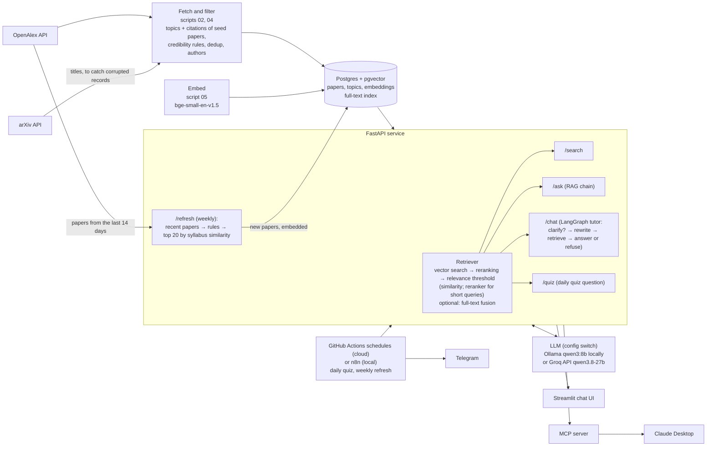
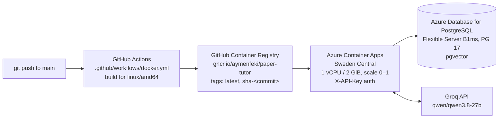

# paper-tutor


paper-tutor is a study assistant that answers questions from a curated database of
research papers instead of from the open web. It downloads papers from
[OpenAlex](https://openalex.org), keeps only those that pass a set of credibility rules
(peer-reviewed venue list, a real abstract, not retracted, English), removes duplicates,
stores them in Postgres with vector embeddings, and answers questions with an LLM
that must cite the papers it used, or say that the database has nothing relevant. It is built the way a company would build an internal
AI system over its own documents: a data pipeline, a database, an HTTP API, a chat UI,
a tool for an AI assistant, an evaluation of retrieval quality, and a cloud deployment
on Azure. The current corpus
has 7,183 papers in statistics, econometrics, machine learning, deep learning, LLMs and
agents, economics, finance and cloud infrastructure: 7,163 from the initial download and
20 added by the first weekly refresh.

**Stack:** Python · PostgreSQL + pgvector · FastAPI · LangChain · LangGraph · MCP · Ollama · Groq · Streamlit · n8n · Docker · GitHub Actions · Azure Container Apps · Azure Database for PostgreSQL

## Architecture



- **Pipeline** (`scripts/`): numbered scripts that fetch, explore, load, embed, search,
  evaluate and ask. Shared logic lives in `src/paper_tutor/`.
- **Database** (`sql/schema.sql`): three tables, `topics`, `papers` and `embeddings`
  (one row per paper and embedding model, so models can be compared side by side).
- **API** (`src/paper_tutor/api.py`): loads the retriever (embedding model and reranker),
  the LLM chain and the tutor once at startup.
- **Clients**: the Streamlit app, the MCP server and the scheduled jobs (GitHub Actions in
  the cloud, n8n locally) all talk to the API over HTTP.
- **Deployment**: locally with Docker Compose, in the cloud on Azure (see
  [Cloud deployment](#cloud-deployment)).

## Features

Every behaviour below can be switched in `config/syllabus.yaml`, so old and new settings
can be compared. The defaults are the best settings measured (see [eval/README.md](eval/README.md)).

- **Credibility rules** (`settings` in the config, `corpus.py`): keep only articles,
  reviews, preprints and conference papers; English only; drop retracted papers; journal
  articles must come from a venue on the CWTS core list (preprints and conference papers
  are exempt); the abstract must have at least 30 words. Below 30 words the "abstracts"
  in OpenAlex are mostly citation strings ("Technometrics, Vol. 31, No. 2, pp. 270-271"),
  publisher boilerplate or a single word; this rule removed about 200 papers.
- **Trusted preprint servers** (`preprint_servers` in the config): a preprint must come from
  arXiv, RePEc, SSRN or HAL. Open repositories are full of auto-generated spam: 589 of
  1,716 recent candidates were Zenodo "preprints" such as "LAB #2710 ... LEDGER BENCH".
  The rule removed 74 papers from the corpus (26 Zenodo, 18 without a source, 13 bioRxiv,
  7 Research Square, 6 Preprints.org, 4 others). None of them was a test question's
  paper, and the retrieval metrics did not change (see [eval/README.md](eval/README.md)).
- **Deduplication**: papers with the same normalised title published within 3 years of
  each other are one paper, e.g. an arXiv preprint and its conference version, or a
  conference paper and its later journal version. The published version is kept, then
  the one with a DOI, a venue and the longer abstract. 75 duplicates are merged, 31 of
  them across years.
- **LLMs and agents area** ([#9](https://github.com/AymenFeki/paper-tutor/issues/9)): built around five seed papers (RAG, ReAct, Toolformer,
  Chain-of-Thought, GPT-3) instead of OpenAlex topics. Candidates are the 200 most-cited
  papers citing each seed plus the papers the seeds cite (999 papers). They go through the
  same credibility rules (802 pass; conference papers and preprints are exempt from the
  venue list, which matters because ML is published on arXiv and at conferences), must
  mention an LLM keyword in title or abstract (573; without this filter the most-cited
  candidates were LSTM, GloVe, word2vec and Vision Transformers, which cite or are cited by
  GPT-3), and must not have a corrupted arXiv record (see below). The 300 most-cited are
  kept; 294 are new to the corpus, the others were already in another area.
- **Weekly refresh** (`refresh.py`, `refresh` in the config): `POST /refresh` (or
  `make refresh`) fetches the papers published in the last 14 days for every topic,
  applies the credibility rules, removes duplicates, and scores each paper by its highest
  cosine similarity to any learn query of the syllabus. The top 20 papers of the window
  with a similarity of at least 0.75 are added if they are not in the database yet (same
  OpenAlex id or same normalised title). 0.75 comes from the measured scores: the best
  papers score about 0.82-0.85, spam and off-topic papers 0.55-0.71. Because the top 20 is
  chosen before known papers are skipped, running it again adds nothing, and the next
  week only adds what has entered the top 20. New papers are written to
  `data/raw/recent/<date>.json` (and their authors to `data/raw/authors.json`) before they
  are saved and embedded, so the raw files stay the source of truth and `make load` keeps
  them. The raw records are also stored in the `refreshed_raw` table, because in the cloud
  container `data/raw/` is lost on every restart; `make pull-refreshed` copies them from the
  cloud database into `data/raw/recent/` ([#29](https://github.com/AymenFeki/paper-tutor/issues/29)).
  The first run had 1,124 candidates and added 20 papers; it takes about 45 seconds.
- **Automations** ([#14](https://github.com/AymenFeki/paper-tutor/issues/14),
  [#29](https://github.com/AymenFeki/paper-tutor/issues/29)): two scheduled jobs call the API
  and send the result to a Telegram bot. In the cloud they are GitHub Actions workflows
  (`.github/workflows/quiz.yml`, `refresh.yml`) that call the Azure API with the API key, so
  they run without any local machine; each first calls `/health` with retries to wake the API
  from scale-to-zero. Locally the same jobs exist as n8n workflows (`n8n/`).
  - *Daily quiz* (every day at 10:00): `POST /quiz` picks a random learn item from the
    syllabus, retrieves a matching paper and asks the LLM for one multiple-choice question
    (Pydantic model with Telegram's length limits; questions that mention "the paper" or
    contain Chinese characters are rejected and regenerated; options are shuffled). It is
    sent as a Telegram quiz poll, followed by the topic and the source paper.
  - *Weekly refresh* (Sundays at 20:00): `POST /refresh`, then a Telegram message listing
    the papers added and their scores.
- **Corrupted OpenAlex records**: some records keep the DOI and citation count of a famous
  arXiv paper but show an unrelated title, abstract and references. The arXiv DOIs of RAG,
  ReAct and Chain-of-Thought point to records titled "Affordance-Compiled Intelligence",
  "Distributing Accountability, Not Capability" and "BNAI, NO-TOKEN, and MIND-UNITY".
  `02_fetch.py` downloads arXiv's own titles, and records whose title differs are dropped
  (`check_arxiv_titles`); references are only taken from seed records with the right title.
- **Authors**: the first five author names per paper, shown in the sources and given to
  the LLM, which may name authors only when they appear in the sources.
- **Embeddings**: title and abstract embedded with `BAAI/bge-small-en-v1.5`, searched
  by cosine distance in pgvector. `Qwen/Qwen3-Embedding-0.6B` is also stored for
  comparison; the active model is set in the config.
- **Retrieval** (`rag.py`, `retrieval` in the config):
  - vector search (default),
  - optional hybrid search: Postgres full-text search on title and abstract (GIN index),
    fused with the vector ranking by Reciprocal Rank Fusion,
  - reranking of 30 candidates with the cross-encoder `BAAI/bge-reranker-base` (on by default),
  - a relevance threshold. Queries of at most 5 words ("Jeffreys prior") are judged by the
    reranker (score at least 0.5), longer questions by the cosine similarity (at least
    0.62). If no paper passes, nothing is returned and the tutor says the database has no
    relevant papers instead of answering from irrelevant ones.
- **API endpoints**:
  - `GET /health`: status, active embedding model and retrieval settings.
  - `POST /search`: up to k relevant papers with authors, no LLM.
  - `POST /ask`: a single cited answer from the top papers (no memory).
  - `POST /chat`: the tutor with memory per `thread_id`.
  - `POST /quiz`: one multiple-choice question about a paper for a random syllabus item.
  - `POST /refresh`: the weekly refresh; returns the number of papers added, their titles
    and scores, and the number of candidates.
- **API key** (`api.py`): when the environment variable `API_KEY` is set, every endpoint
  except `/health` requires it in the `X-API-Key` header and answers `401` otherwise. The
  key is compared in constant time (`secrets.compare_digest`). Locally `API_KEY` is not
  set, so the API stays open for the UI, the MCP server and n8n.
- **LLM provider** (`llm.provider` in the config, `llm.py`): `ollama` runs qwen3:8b locally;
  `groq` calls the Groq API (`qwen/qwen3.8-27b`, free tier, needs `GROQ_API_KEY`), which
  answers in seconds instead of about 20 s and is needed for a cloud deployment without a
  GPU. Every chat model (answers, tutor, quiz) is built by one function, `build_llm`, so
  switching is one line in the config. The evaluation numbers were measured with qwen3:8b.
  With Groq, the quiz limits are enforced while generating (text is cut at the limit), so
  the prompt asks for shorter options and explanations than the hard limits.
- **LangGraph tutor** (`tutor.py`):
  - A first question that points at something it doesn't name ("When does it fail?") is
    answered with a clarifying question instead of a search (conditional edge, rule-based
    check in `is_vague`).
  - Follow-up questions such as "how does it compare to ridge?" are rewritten into a
    standalone search query using the conversation.
  - If retrieval returns no papers, the tutor refuses instead of answering (second
    conditional edge); otherwise it answers with the conversation in context.
  - Two answer prompts: `basic`, and `strict` (every sentence must be backed by a cited
    source, no outside knowledge). Memory is kept in process (`InMemorySaver`).
- **MCP tool** (`mcp_server.py`): exposes `search_papers` so Claude Desktop can search
  the database and cite real papers, with authors.
- **Evaluation** (`scripts/07`, `08`, `11`, `12`, `14`): retrieval metrics with confidence
  intervals, out-of-scope questions and keyword queries, threshold calibration and a
  citation faithfulness check.
- **Judging app** (`app/judge.py`, `make judge`): shows unjudged (question, paper) pairs
  one at a time, without saying which retrieval variant found them, and appends the
  answer to `eval/judgments.yaml` with `judge: human` ([#5](https://github.com/AymenFeki/paper-tutor/issues/5)).
- **Data checks** (`scripts/13_data_checks.py`, `make data-checks`): a report on reviews,
  title-abstract mismatches, area labels and corrupted arXiv records; nothing is deleted.

## Evaluation

34 test questions, 444 pooled relevance judgments (75 by hand), plus 50 out-of-scope and
keyword queries. Full method, all tables and caveats: [eval/README.md](eval/README.md).

| What is measured | Result |
|---|---|
| Retrieval: relevant paper in the top 5 (pooled judgments) | 30/34 with the reranker (25/34 without) |
| Retrieval: MRR (pooled judgments) | 0.76 with the reranker (0.64 without) |
| In-scope queries answered, off-topic queries refused | 84/84 (30/30 on held-out queries) |
| Citations supported by the cited abstract (8B judge) | 31/34 with the reranker (22/30 without; 24/30 before), strict prompt; a hand check finds the judge too lenient |

## Data checks

`scripts/13_data_checks.py` writes every flagged paper to `eval/data_checks/*.csv`.
Nothing is deleted.

| Check | Flagged | Recommendation |
|---|---|---|
| Reviews, surveys, tutorials, lecture notes by title/abstract patterns ([#19](https://github.com/AymenFeki/paper-tutor/issues/19)) | 499 papers (6.9%); OpenAlex's type `review` covers only 20 | Keep them: overviews are what a student needs. Store a flag and test a small ranking boost, judged with the new judgments. The patterns are rough ("peer review" also matches). |
| Title-abstract mismatch: lowest 1% similarity between title and abstract embedding ([#20](https://github.com/AymenFeki/paper-tutor/issues/20)) | 72 papers below 0.608 (median 0.866); the example W2040503026 is 67th lowest | Do not act automatically: about half (37) are just short titles such as system names ("ZOO", "Quincy", "Omega"). The rest are worth a manual look; a few have publisher boilerplate as abstract. |
| Closer to another area's centroid than to their own ([#21](https://github.com/AymenFeki/paper-tutor/issues/21)) | 1,471 papers (20.4%); 656 with a margin above 0.02, 25 above 0.08 | Do not relabel now: areas overlap by nature (statistics/econometrics, finance/economics) and the area is only used for reporting, not for retrieval. The 25 large-margin cases are clear mislabels, e.g. Granger's "Investigating Causal Relations by Econometric Models" filed under deep learning. |
| OpenAlex title differs from arXiv's title | 1 of 846 arXiv papers (W2900470550) | Turn the arXiv check on for all areas, not only seed areas; it costs one request per 100 papers. |

## Cloud deployment

The API runs on Azure ([#18](https://github.com/AymenFeki/paper-tutor/issues/18)). Every
push to `main` that changes the code builds a new image automatically:



| Part | Service | Notes |
|---|---|---|
| API container | Azure Container Apps | 1 vCPU / 2 GiB, scales to zero when idle, at most 1 replica |
| Database | Azure Database for PostgreSQL Flexible Server (B1ms, PostgreSQL 17) | pgvector enabled; filled from the local database with `pg_dump`/`pg_restore` (7,183 papers) |
| LLM | Groq (`qwen/qwen3.8-27b`) | `provider: groq` in `config/syllabus.yaml` |
| Image registry | GitHub Container Registry | built by `.github/workflows/docker.yml`, tagged `latest` and `sha-<commit>` |

- **Image** (`Dockerfile`): Python 3.12 slim with uv. A CPU-only PyTorch build
  (`[tool.uv.sources]` in `pyproject.toml`, Linux only) keeps the image at about 1.6 GB
  compressed instead of 20+ GB with the CUDA libraries. The embedding model and the
  reranker are downloaded at build time, so a cold start does not download them, and
  `HF_HUB_OFFLINE=1` keeps the container from contacting Hugging Face. Dependencies are
  installed before the code is copied, so a code change rebuilds in seconds.
- **Secrets**: the Groq key, the database password and the API key are Container Apps
  secrets, passed to the container as environment variables. They are never in the image
  or the repository (`.env` is excluded by `.dockerignore` and `.gitignore`).
- **Configuration** (environment variables; the defaults are the local Docker database):

  | Variable | Default (local) | Cloud |
  |---|---|---|
  | `POSTGRES_HOST` | `localhost` | Azure server hostname |
  | `POSTGRES_PORT`, `POSTGRES_DB`, `POSTGRES_USER` | `5432`, `paper_tutor`, `tutor` | same |
  | `POSTGRES_PASSWORD` | from `.env` | secret |
  | `POSTGRES_SSLMODE` | `prefer` | `require` |
  | `GROQ_API_KEY` | from `.env` | secret |
  | `API_KEY` | not set (no auth) | secret |

- **Cost**: inside the Azure for Students free tier. B1ms with 32 GB storage is free for
  12 months (750 hours a month), and scale-to-zero keeps the container within the monthly
  free grant of Container Apps.

- **Scheduled jobs**: GitHub Actions calls the cloud API on a schedule (cron in UTC): the
  daily quiz at 08:00 UTC and the weekly refresh on Sundays at 18:00 UTC. They need four
  repository secrets: `CLOUD_API_URL`, `CLOUD_API_KEY`, `TELEGRAM_BOT_TOKEN` and
  `TELEGRAM_CHAT_ID`. The cloud refresh needs `OPENALEX_API_KEY` as a Container Apps secret.
  Both can also be started by hand from the Actions tab (*Run workflow*).
- **Keeping the local copy in sync**: the cloud database is the one that grows. To bring
  refreshed papers to the local database:

  ```bash
  POSTGRES_HOST=<azure host> POSTGRES_PASSWORD=<azure password> POSTGRES_SSLMODE=require make pull-refreshed
  make load && make embed
  ```

Health check of the live API (the other endpoints need the key):

```bash
curl https://paper-tutor-api.blackpebble-a7183b5c.swedencentral.azurecontainerapps.io/health
```

A question to the live API:

```bash
curl -X POST https://paper-tutor-api.blackpebble-a7183b5c.swedencentral.azurecontainerapps.io/ask \
  -H "Content-Type: application/json" \
  -H "X-API-Key: $CLOUD_API_KEY" \
  -d '{"question": "What is the lasso?"}'
```

## Screenshots

Coming soon.

## Quickstart

### Prerequisites

- [uv](https://docs.astral.sh/uv/) (Python 3.12 is installed by uv if needed)
- [Docker](https://www.docker.com/) with Docker Compose
- An LLM, chosen with `llm.provider` in the config: a free [Groq](https://console.groq.com)
  API key (`groq`), or [Ollama](https://ollama.com) with the model pulled:
  `ollama pull qwen3:8b` (`ollama`)
- An [OpenAlex API key](https://openalex.org)
- A `.env` file in the project root with these variables (`NAME=value`, no spaces around
  `=`, so Docker can read it too):
  - `OPENALEX_API_KEY`: your OpenAlex key
  - `POSTGRES_PASSWORD`: any password; Docker Compose uses it to create the database
  - `GROQ_API_KEY`: needed when `llm.provider` is `groq`
  - optional, for the n8n automations: `TELEGRAM_BOT_TOKEN` (from @BotFather) and
    `TELEGRAM_CHAT_ID`

### Build the database and start the app

```bash
uv sync               # install dependencies
make rebuild          # start Postgres, create tables, fetch, load and embed papers
make api              # start the API on http://127.0.0.1:8000 (keep it running)
make ui               # in a second terminal: start the chat UI
```

Other targets: `make test` (unit tests), `make lint` (ruff), the single steps
`make db-up`, `make schema`, `make fetch`, `make load`, `make embed`, `make refresh`, the evaluations
`make evaluate`, `make threshold`, `make keyword-queries` and `make faithfulness`, and
`make data-checks` and `make judge`. Fetching skips topics, seed areas, authors and arXiv
titles that are already downloaded to `data/raw/`. Loading removes papers from the
database that no longer pass the rules or are not in `data/raw/` (including the refreshed
papers in `data/raw/recent/`), together with their embeddings.

Try the API directly:

```bash
curl -X POST http://127.0.0.1:8000/search \
  -H "Content-Type: application/json" \
  -d '{"question": "What is the lasso?", "k": 3}'
```

### Run the API in Docker

The same image that runs on Azure, against the local database (port 8001, so it does not
clash with `make api`):

```bash
docker build -t paper-tutor-api .
docker run --rm -p 8001:8000 --env-file .env -e POSTGRES_HOST=host.docker.internal paper-tutor-api
```

### Use it from Claude Desktop (MCP)

With the API running, add this to Claude Desktop's `claude_desktop_config.json` and
restart Claude Desktop. Replace the paths with your own (`which uv` shows the path to uv).

```json
{
  "mcpServers": {
    "paper-tutor": {
      "command": "/absolute/path/to/uv",
      "args": [
        "--directory", "/absolute/path/to/paper-tutor",
        "run", "python", "-m", "paper_tutor.mcp_server"
      ]
    }
  }
}
```

The MCP server calls the API at `http://127.0.0.1:8000`; set `PAPER_TUTOR_API` in an
`"env"` block to change it.

### Automations with n8n and Telegram (local)

The cloud runs the same jobs with GitHub Actions (see [Cloud deployment](#cloud-deployment)).
To run them locally instead:

1. `docker compose up -d` also starts n8n on http://localhost:5678. It reads
  `TELEGRAM_BOT_TOKEN` from `.env`, so the token never appears in a workflow.
2. In n8n, import `n8n/daily_quiz.json` and `n8n/weekly_refresh.json`, add a Telegram
  credential, set your chat id, and publish both workflows.
3. Keep the API running (`make api`); n8n reaches it at `http://host.docker.internal:8000`.

## Known limitations

- **Most relevance judgments come from an LLM.** 75 of 444 are human; a hand-checked
  sample agreed 19/20 with the LLM labels, but the set is still small (34 questions).
- **The thresholds were chosen on the queries they are tested on.** 30 new held-out
  queries (including 5–6 words) are also all answered or refused correctly. But the
  similarity margin for longer queries is small (0.03–0.05 from the threshold on both
  sets), and a 6-word query with only 2 matching papers in the database is still
  answered (see eval/README.md).
- **Citations from the 8B model are not always faithful**, even with the strict prompt,
  and the faithfulness check uses the same 8B model as judge
  ([#7](https://github.com/AymenFeki/paper-tutor/issues/7)).
- **The agents area is ranked by citations**, so it leans towards widely cited application
  papers (medicine, chemistry); the keyword filter still lets a few hardware papers in
  (e.g. TPU v4, whose abstract mentions language models).
- **Area labels are noisy** (see Data checks); 20% of papers are closer to another area,
  mostly at natural borders ([#21](https://github.com/AymenFeki/paper-tutor/issues/21)).
- **Short-abstract junk above 30 words remains**, e.g. reference strings like "Claes
  Fornell, David F. Larcker, Structural Equation Models with ..., Journal of ...".
- **Only the first five authors are stored**, so the sources cannot say whether a paper
  has more authors.
- **The clarification check is a simple word rule.** It catches "When does it fail?" but
  not every vague question.
- **The weekly refresh never covers the LLMs and agents area.** It is built from seed
  papers, not OpenAlex topics, and the refresh only queries topics.
- **The refresh takes one top 20 across all areas**, so busy areas win: the first run
  added 7 finance, 7 statistics, 3 deep learning, 2 economics and 1 machine learning
  paper, none for cloud infrastructure. A quota per area would balance it.
- **Syllabus similarity measures topic, not quality.** The weakest refreshed papers are
  applied studies from broad journals (an India VIX-RSI market-efficiency study in
  F1000Research, a buzzword-heavy causal-inference framework in *Electronics*); they pass
  because the journals are on the CWTS list.
- **The trusted-server rule only checks preprints.** A Zenodo record typed as a conference
  paper still passes (one such paper is in the corpus), because conference papers are
  exempt from the venue list.
- **Refreshed papers are only embedded with the active model** (bge-small). Run
  `uv run python scripts/05_embed.py qwen3-0.6b` before comparing against Qwen3 again.
- **GitHub Actions schedules are best effort**: runs can start several minutes late, the
  times shift by an hour with daylight saving time (cron is in UTC), and GitHub disables
  scheduled workflows in a repository without activity for 60 days.
- **The local database does not update by itself.** The weekly refresh writes to the cloud
  database; `make pull-refreshed`, `make load` and `make embed` bring the new papers to the
  local one.
- **The cloud refresh must finish within Azure's request timeout** (about 4 minutes per
  HTTP request). The first cloud run took about 4 minutes in total with the cold start.
- **Cold start**: after a period without traffic, the first request to the cloud API
  takes about a minute (container start and model loading). That is the cost of scaling
  to zero.
- **Deploying a new version is half manual**: GitHub Actions builds and pushes the image,
  but the Container App is switched to the new `sha-<commit>` tag by hand.
- **Conversation memory is in process**: `/chat` threads are lost when the container
  restarts or scales to zero.
- **Quiz answer keys are not verified.** The LLM sometimes marks the wrong option as correct
  (seen with qwen3:8b); a second LLM call that answers the question without the key could catch it.

## Roadmap

- Verify quiz answer keys with a second LLM call ([#24](https://github.com/AymenFeki/paper-tutor/issues/24)).
- Add new LLM and agent papers in the weekly refresh ([#25](https://github.com/AymenFeki/paper-tutor/issues/25)).
- A quota per area in the refresh instead of one global top 20 ([#26](https://github.com/AymenFeki/paper-tutor/issues/26)).
- Check untrusted repositories for all paper types, not only preprints ([#27](https://github.com/AymenFeki/paper-tutor/issues/27)).
- Fix papers assigned to the wrong area ([#21](https://github.com/AymenFeki/paper-tutor/issues/21)).
- More data sources and better coverage for all areas ([#8](https://github.com/AymenFeki/paper-tutor/issues/8)).
