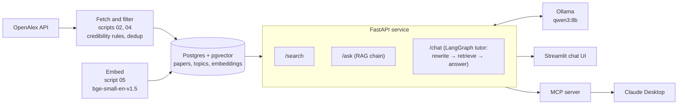

# paper-tutor


paper-tutor is a study assistant that answers questions from a curated database of
research papers instead of from the open web. It downloads papers from
[OpenAlex](https://openalex.org), keeps only those that pass a set of credibility rules
(peer-reviewed venue list, abstract present, not retracted, English), removes duplicates,
stores them in Postgres with vector embeddings, and answers questions with a local LLM
that must cite the papers it used. It is built the way a company would build an internal
AI system over its own documents: a data pipeline, a database, an HTTP API, a chat UI,
a tool for an AI assistant, and an evaluation of retrieval quality. The current corpus
has 7,168 papers in statistics, econometrics, machine learning, deep learning,
economics, finance and cloud infrastructure.

**Stack:** Python · PostgreSQL + pgvector · FastAPI · LangChain · LangGraph · MCP · Ollama · Streamlit · Docker · GitHub Actions

## Architecture



- **Pipeline** (`scripts/`): numbered scripts that fetch, explore, load, embed, search,
  evaluate and ask. Shared logic lives in `src/paper_tutor/`.
- **Database** (`sql/schema.sql`): three tables, `topics`, `papers` and `embeddings`
  (one row per paper and embedding model, so models can be compared side by side).
- **API** (`src/paper_tutor/api.py`): loads the embedding model, LLM chain and tutor
  once at startup.
- **Clients**: the Streamlit app and the MCP server both talk to the API over HTTP.

## Features

- **Credibility rules** (`config/syllabus.yaml`, `corpus.py`): keep only articles,
  reviews, preprints and conference papers; require an abstract; English only; drop
  retracted papers; journal articles must come from a venue on the CWTS core list
  (preprints and conference papers are exempt).
- **Deduplication**: papers with the same normalised title and year are merged; the
  record with a DOI and the longer abstract wins.
- **Embeddings**: title and abstract embedded with `BAAI/bge-small-en-v1.5`, searched
  by cosine distance in pgvector. `Qwen/Qwen3-Embedding-0.6B` is also stored for
  comparison; the active model is set in the config.
- **API endpoints**:
  - `GET /health`: status and active embedding model.
  - `POST /search`: the k closest papers, no LLM.
  - `POST /ask`: a single cited answer from the top papers (no memory).
  - `POST /chat`: the tutor with memory per `thread_id`.
- **LangGraph tutor** (`tutor.py`): a three-step graph. Follow-up questions such as
  "how does it compare to ridge?" are rewritten into a standalone search query using
  the conversation, then papers are retrieved and the answer is written with the full
  conversation in context. Memory is kept in process (`InMemorySaver`).
- **MCP tool** (`mcp_server.py`): exposes `search_papers` so Claude Desktop can search
  the database and cite real papers.
- **Evaluation** (`scripts/07_evaluate.py`, `scripts/08_pooled_evaluate.py`): retrieval
  metrics on a fixed question set, with confidence intervals.

## Evaluation

28 test questions, 4 per area, each written for one specific paper in the corpus
(`eval/questions.yaml`). For each question the top 10 papers are retrieved and the
rank of that paper is recorded. Results are in `eval/results/`.

| Embedding model | n | hit@1 | hit@5 | hit@10 | MRR | hit@5 95% Wilson CI |
|---|---|---|---|---|---|---|
| bge-small-en-v1.5 (active) | 28 | 0.32 | 0.46 | 0.64 | 0.40 | [0.30, 0.64] |
| Qwen3-Embedding-0.6B | 28 | 0.21 | 0.50 | 0.61 | 0.31 | [0.33, 0.67] |

Counting only one paper as relevant is strict, because other papers in the corpus can
answer the same question. So the top 5 of both models (plus the original paper) were
pooled and judged for relevance (`eval/judgments.yaml`, 239 judgments). With these
pooled judgments (`uv run python scripts/08_pooled_evaluate.py`):

| Embedding model | hit@5 | hit@5 95% Wilson CI | MRR (lower bound) |
|---|---|---|---|
| bge-small-en-v1.5 | 22/28 (0.79) | [0.60, 0.90] | 0.68 |
| Qwen3-Embedding-0.6B | 24/28 (0.86) | [0.69, 0.94] | 0.68 |

How to read these numbers:

- The sample is small (28 questions), so the intervals are wide and the two models are
  not clearly different.
- The questions and the relevance judgments were written by an LLM, not by people. The
  judge saw titles and abstracts in shuffled order without model or rank labels, but had
  already seen the models' results earlier, so the judging was **not fully blind**. A
  human review of a sample is still open
  ([#5](https://github.com/AymenFeki/paper-tutor/issues/5)).
- Questions were written while reading each abstract, so they may be easier than real
  student questions.
- Only retrieval is measured. Answer quality and citation faithfulness are not
  measured yet ([#7](https://github.com/AymenFeki/paper-tutor/issues/7)).

## Screenshots

Coming soon.

## Quickstart

### Prerequisites

- [uv](https://docs.astral.sh/uv/) (Python 3.12 is installed by uv if needed)
- [Docker](https://www.docker.com/) with Docker Compose
- [Ollama](https://ollama.com) with the model pulled: `ollama pull qwen3:8b`
- An [OpenAlex API key](https://openalex.org)
- A `.env` file in the project root with two variables:
  - `OPENALEX_API_KEY`: your OpenAlex key
  - `POSTGRES_PASSWORD`: any password; Docker Compose uses it to create the database

### Build the database and start the app

```bash
uv sync               # install dependencies
make rebuild          # start Postgres, create tables, fetch, load and embed papers
make api              # start the API on http://127.0.0.1:8000 (keep it running)
make ui               # in a second terminal: start the chat UI
```

Other targets: `make test` (unit tests), `make lint` (ruff), and the single steps
`make db-up`, `make schema`, `make fetch`, `make load`, `make embed`. Fetching skips
topics that are already downloaded to `data/raw/`.

Try the API directly:

```bash
curl -X POST http://127.0.0.1:8000/search \
  -H "Content-Type: application/json" \
  -d '{"question": "What is the lasso?", "k": 3}'
```

### Use it from Claude Desktop (MCP)

With the API running, add this to Claude Desktop's `claude_desktop_config.json` and
restart Claude Desktop. Replace the paths with your own (`which uv` shows the path to uv).

```json
{
  "mcpServers": {
    "paper-tutor": {
      "command": "/absolute/path/to/uv",
      "args": [
        "--directory", "/absolute/path/to/paper-tutor",
        "run", "python", "-m", "paper_tutor.mcp_server"
      ]
    }
  }
}
```

The MCP server calls the API at `http://127.0.0.1:8000`; set `PAPER_TUTOR_API` in an
`"env"` block to change it.

## Known limitations

- **Retrieval ranking is unstable across query wordings.** Two phrasings of the same
  question can return quite different papers. A reranker
  ([#1](https://github.com/AymenFeki/paper-tutor/issues/1)) and hybrid search with
  Postgres full-text search ([#2](https://github.com/AymenFeki/paper-tutor/issues/2))
  are planned.
- **Citations from the 8B model are not always faithful.** qwen3:8b sometimes cites a
  source for a claim that the source does not support. A faithfulness check is planned
  ([#7](https://github.com/AymenFeki/paper-tutor/issues/7)).
- **No similarity threshold.** Search always returns k papers, even when none of them
  is relevant, so out-of-scope questions still get sources. Out-of-scope test questions
  are planned ([#22](https://github.com/AymenFeki/paper-tutor/issues/22)).
- **Cross-year duplicates.** Deduplication uses title and year, so a working paper and
  its later journal version can both appear
  ([#4](https://github.com/AymenFeki/paper-tutor/issues/4)).
- **Authors are not stored**, so answers cannot name authors and the prompt tells the
  model not to ([#23](https://github.com/AymenFeki/paper-tutor/issues/23)).

## Roadmap

- n8n workflows: a daily quiz via Telegram and a weekly fetch of new papers
  ([#14](https://github.com/AymenFeki/paper-tutor/issues/14)).
- Optional cloud deployment
  ([#18](https://github.com/AymenFeki/paper-tutor/issues/18)).