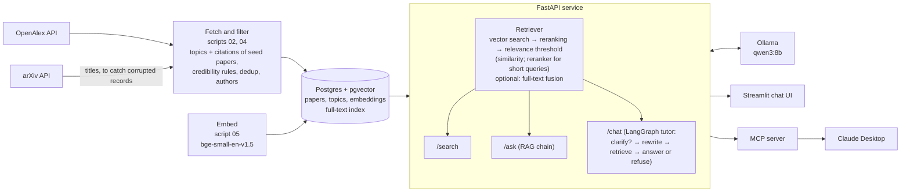

# paper-tutor


paper-tutor is a study assistant that answers questions from a curated database of
research papers instead of from the open web. It downloads papers from
[OpenAlex](https://openalex.org), keeps only those that pass a set of credibility rules
(peer-reviewed venue list, a real abstract, not retracted, English), removes duplicates,
stores them in Postgres with vector embeddings, and answers questions with a local LLM
that must cite the papers it used, or say that the database has nothing relevant. It is built the way a company would build an internal
AI system over its own documents: a data pipeline, a database, an HTTP API, a chat UI,
a tool for an AI assistant, and an evaluation of retrieval quality. The current corpus
has 7,226 papers in statistics, econometrics, machine learning, deep learning, LLMs and
agents, economics, finance and cloud infrastructure.

**Stack:** Python · PostgreSQL + pgvector · FastAPI · LangChain · LangGraph · MCP · Ollama · Streamlit · Docker · GitHub Actions

## Architecture



- **Pipeline** (`scripts/`): numbered scripts that fetch, explore, load, embed, search,
  evaluate and ask. Shared logic lives in `src/paper_tutor/`.
- **Database** (`sql/schema.sql`): three tables, `topics`, `papers` and `embeddings`
  (one row per paper and embedding model, so models can be compared side by side).
- **API** (`src/paper_tutor/api.py`): loads the retriever (embedding model and reranker),
  the LLM chain and the tutor once at startup.
- **Clients**: the Streamlit app and the MCP server both talk to the API over HTTP.

## Features

Every behaviour below can be switched in `config/syllabus.yaml`, so old and new settings
can be compared. The defaults are the best settings measured (see [eval/README.md](eval/README.md)).

- **Credibility rules** (`settings` in the config, `corpus.py`): keep only articles,
  reviews, preprints and conference papers; English only; drop retracted papers; journal
  articles must come from a venue on the CWTS core list (preprints and conference papers
  are exempt); the abstract must have at least 30 words. Below 30 words the "abstracts"
  in OpenAlex are mostly citation strings ("Technometrics, Vol. 31, No. 2, pp. 270-271"),
  publisher boilerplate or a single word; this rule removed about 200 papers.
- **Deduplication**: papers with the same normalised title published within 3 years of
  each other are one paper, e.g. an arXiv preprint and its conference version, or a
  conference paper and its later journal version. The published version is kept, then
  the one with a DOI, a venue and the longer abstract. 78 duplicates are merged, 34 of
  them across years.
- **LLMs and agents area** ([#9](https://github.com/AymenFeki/paper-tutor/issues/9)): built around five seed papers (RAG, ReAct, Toolformer,
  Chain-of-Thought, GPT-3) instead of OpenAlex topics. Candidates are the 200 most-cited
  papers citing each seed plus the papers the seeds cite (999 papers). They go through the
  same credibility rules (833 pass; conference papers and preprints are exempt from the
  venue list, which matters because ML is published on arXiv and at conferences), must
  mention an LLM keyword in title or abstract (597; without this filter the most-cited
  candidates were LSTM, GloVe, word2vec and Vision Transformers, which cite or are cited by
  GPT-3), and must not have a corrupted arXiv record (see below). The 300 most-cited are
  kept; 293 are new to the corpus, the others were already in another area.
- **Corrupted OpenAlex records**: some records keep the DOI and citation count of a famous
  arXiv paper but show an unrelated title, abstract and references. The arXiv DOIs of RAG,
  ReAct and Chain-of-Thought point to records titled "Affordance-Compiled Intelligence",
  "Distributing Accountability, Not Capability" and "BNAI, NO-TOKEN, and MIND-UNITY".
  `02_fetch.py` downloads arXiv's own titles, and records whose title differs are dropped
  (`check_arxiv_titles`); references are only taken from seed records with the right title.
- **Authors**: the first five author names per paper, shown in the sources and given to
  the LLM, which may name authors only when they appear in the sources.
- **Embeddings**: title and abstract embedded with `BAAI/bge-small-en-v1.5`, searched
  by cosine distance in pgvector. `Qwen/Qwen3-Embedding-0.6B` is also stored for
  comparison; the active model is set in the config.
- **Retrieval** (`rag.py`, `retrieval` in the config):
  - vector search (default),
  - optional hybrid search: Postgres full-text search on title and abstract (GIN index),
    fused with the vector ranking by Reciprocal Rank Fusion,
  - reranking of 30 candidates with the cross-encoder `BAAI/bge-reranker-base` (on by default),
  - a relevance threshold. Queries of at most 5 words ("Jeffreys prior") are judged by the
    reranker (score at least 0.5), longer questions by the cosine similarity (at least
    0.62). If no paper passes, nothing is returned and the tutor says the database has no
    relevant papers instead of answering from irrelevant ones.
- **API endpoints**:
  - `GET /health`: status, active embedding model and retrieval settings.
  - `POST /search`: up to k relevant papers with authors, no LLM.
  - `POST /ask`: a single cited answer from the top papers (no memory).
  - `POST /chat`: the tutor with memory per `thread_id`.
- **LangGraph tutor** (`tutor.py`):
  - A first question that points at something it doesn't name ("When does it fail?") is
    answered with a clarifying question instead of a search (conditional edge, rule-based
    check in `is_vague`).
  - Follow-up questions such as "how does it compare to ridge?" are rewritten into a
    standalone search query using the conversation.
  - If retrieval returns no papers, the tutor refuses instead of answering (second
    conditional edge); otherwise it answers with the conversation in context.
  - Two answer prompts: `basic`, and `strict` (every sentence must be backed by a cited
    source, no outside knowledge). Memory is kept in process (`InMemorySaver`).
- **MCP tool** (`mcp_server.py`): exposes `search_papers` so Claude Desktop can search
  the database and cite real papers, with authors.
- **Evaluation** (`scripts/07`, `08`, `11`, `12`, `14`): retrieval metrics with confidence
  intervals, out-of-scope questions and keyword queries, threshold calibration and a
  citation faithfulness check.
- **Judging app** (`app/judge.py`, `make judge`): shows unjudged (question, paper) pairs
  one at a time, without saying which retrieval variant found them, and appends the
  answer to `eval/judgments.yaml` with `judge: human` ([#5](https://github.com/AymenFeki/paper-tutor/issues/5)).
- **Data checks** (`scripts/13_data_checks.py`, `make data-checks`): a report on reviews,
  title-abstract mismatches, area labels and corrupted arXiv records; nothing is deleted.

## Evaluation

34 test questions, 444 pooled relevance judgments (75 by hand), plus 50 out-of-scope and
keyword queries. Full method, all tables and caveats: [eval/README.md](eval/README.md).

| What is measured | Result |
|---|---|
| Retrieval: relevant paper in the top 5 (pooled judgments) | 30/34 with the reranker (25/34 without) |
| Retrieval: MRR (pooled judgments) | 0.76 with the reranker (0.64 without) |
| In-scope queries answered, off-topic queries refused | 84/84 (30/30 on held-out queries) |
| Citations supported by the cited abstract (8B judge) | 31/34 with the reranker (22/30 without; 24/30 before), strict prompt; a hand check finds the judge too lenient |

## Data checks

`scripts/13_data_checks.py` writes every flagged paper to `eval/data_checks/*.csv`.
Nothing is deleted.

| Check | Flagged | Recommendation |
|---|---|---|
| Reviews, surveys, tutorials, lecture notes by title/abstract patterns ([#19](https://github.com/AymenFeki/paper-tutor/issues/19)) | 499 papers (6.9%); OpenAlex's type `review` covers only 20 | Keep them: overviews are what a student needs. Store a flag and test a small ranking boost, judged with the new judgments. The patterns are rough ("peer review" also matches). |
| Title-abstract mismatch: lowest 1% similarity between title and abstract embedding ([#20](https://github.com/AymenFeki/paper-tutor/issues/20)) | 72 papers below 0.608 (median 0.866); the example W2040503026 is 67th lowest | Do not act automatically: about half (37) are just short titles such as system names ("ZOO", "Quincy", "Omega"). The rest are worth a manual look; a few have publisher boilerplate as abstract. |
| Closer to another area's centroid than to their own ([#21](https://github.com/AymenFeki/paper-tutor/issues/21)) | 1,471 papers (20.4%); 656 with a margin above 0.02, 25 above 0.08 | Do not relabel now: areas overlap by nature (statistics/econometrics, finance/economics) and the area is only used for reporting, not for retrieval. The 25 large-margin cases are clear mislabels, e.g. Granger's "Investigating Causal Relations by Econometric Models" filed under deep learning. |
| OpenAlex title differs from arXiv's title | 1 of 846 arXiv papers (W2900470550) | Turn the arXiv check on for all areas, not only seed areas; it costs one request per 100 papers. |

## Screenshots

Coming soon.

## Quickstart

### Prerequisites

- [uv](https://docs.astral.sh/uv/) (Python 3.12 is installed by uv if needed)
- [Docker](https://www.docker.com/) with Docker Compose
- [Ollama](https://ollama.com) with the model pulled: `ollama pull qwen3:8b`
- An [OpenAlex API key](https://openalex.org)
- A `.env` file in the project root with two variables:
  - `OPENALEX_API_KEY`: your OpenAlex key
  - `POSTGRES_PASSWORD`: any password; Docker Compose uses it to create the database

### Build the database and start the app

```bash
uv sync               # install dependencies
make rebuild          # start Postgres, create tables, fetch, load and embed papers
make api              # start the API on http://127.0.0.1:8000 (keep it running)
make ui               # in a second terminal: start the chat UI
```

Other targets: `make test` (unit tests), `make lint` (ruff), the single steps
`make db-up`, `make schema`, `make fetch`, `make load`, `make embed`, the evaluations
`make evaluate`, `make threshold`, `make keyword-queries` and `make faithfulness`, and
`make data-checks` and `make judge`. Fetching skips topics, seed areas, authors and arXiv
titles that are already downloaded to `data/raw/`. Loading removes papers from the
database that no longer pass the rules, together with their embeddings.

Try the API directly:

```bash
curl -X POST http://127.0.0.1:8000/search \
  -H "Content-Type: application/json" \
  -d '{"question": "What is the lasso?", "k": 3}'
```

### Use it from Claude Desktop (MCP)

With the API running, add this to Claude Desktop's `claude_desktop_config.json` and
restart Claude Desktop. Replace the paths with your own (`which uv` shows the path to uv).

```json
{
  "mcpServers": {
    "paper-tutor": {
      "command": "/absolute/path/to/uv",
      "args": [
        "--directory", "/absolute/path/to/paper-tutor",
        "run", "python", "-m", "paper_tutor.mcp_server"
      ]
    }
  }
}
```

The MCP server calls the API at `http://127.0.0.1:8000`; set `PAPER_TUTOR_API` in an
`"env"` block to change it.

## Known limitations

- **Most relevance judgments come from an LLM.** 75 of 444 are human; a hand-checked
  sample agreed 19/20 with the LLM labels, but the set is still small (34 questions).
- **The thresholds were chosen on the queries they are tested on.** 30 new held-out
  queries (including 5–6 words) are also all answered or refused correctly. But the
  similarity margin for longer queries is small (0.03–0.05 from the threshold on both
  sets), and a 6-word query with only 2 matching papers in the database is still
  answered (see eval/README.md).
- **Citations from the 8B model are not always faithful**, even with the strict prompt,
  and the faithfulness check uses the same 8B model as judge
  ([#7](https://github.com/AymenFeki/paper-tutor/issues/7)).
- **The agents area is ranked by citations**, so it leans towards widely cited application
  papers (medicine, chemistry); the keyword filter still lets a few hardware papers in
  (e.g. TPU v4, whose abstract mentions language models).
- **Area labels are noisy** (see Data checks); 20% of papers are closer to another area,
  mostly at natural borders ([#21](https://github.com/AymenFeki/paper-tutor/issues/21)).
- **Short-abstract junk above 30 words remains**, e.g. reference strings like "Claes
  Fornell, David F. Larcker, Structural Equation Models with ..., Journal of ...".
- **Only the first five authors are stored**, so the sources cannot say whether a paper
  has more authors.
- **The clarification check is a simple word rule.** It catches "When does it fail?" but
  not every vague question.

## Roadmap

- n8n workflows: a daily quiz via Telegram and a weekly fetch of new papers
  ([#14](https://github.com/AymenFeki/paper-tutor/issues/14)).
- Optional cloud deployment
  ([#18](https://github.com/AymenFeki/paper-tutor/issues/18)).